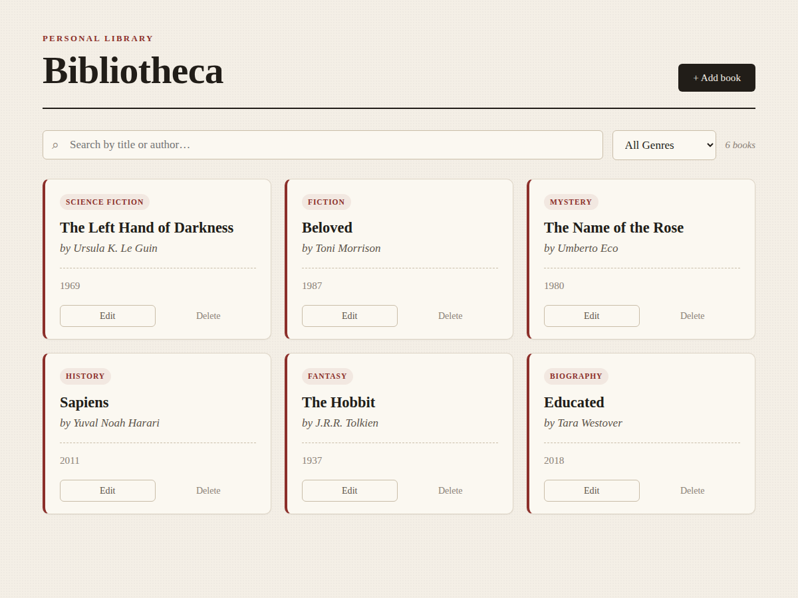
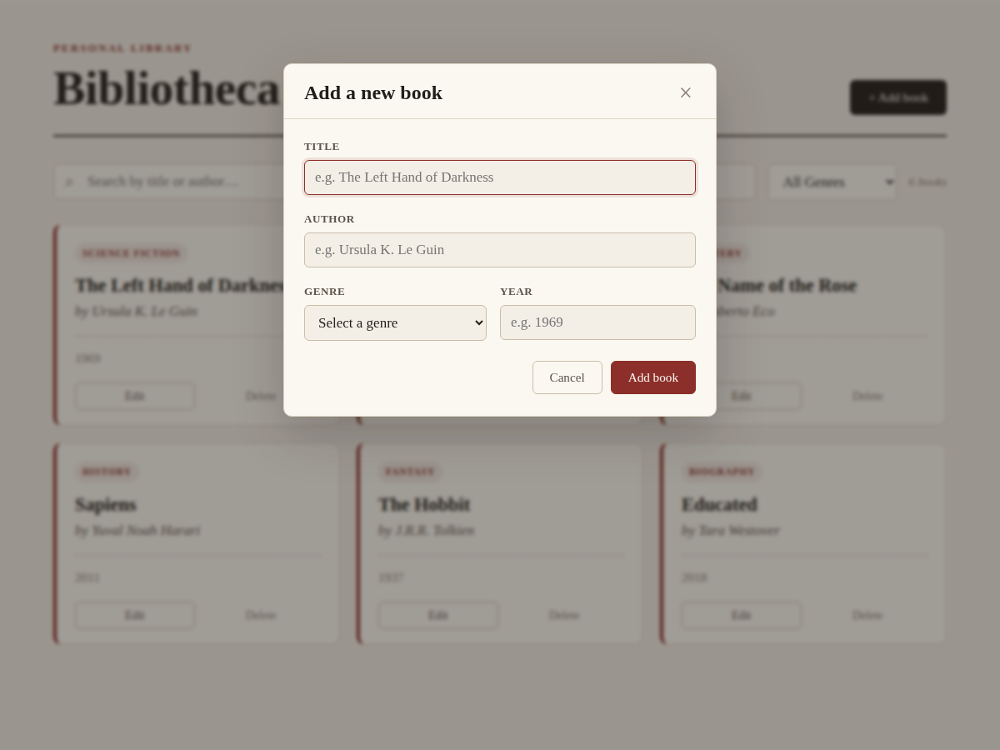

# Bibliotheca — Book Management System

A single-page React application for managing a personal library. Users can view, add, edit, and delete books, search by title or author, and filter by genre. All data is persisted through a REST API.

**Live demo:** _add your deployed URL here_
**Repository:** _add your GitHub URL here_

---

## Features

- **View** all books in a responsive card grid.
- **Add** a new book through a validated form.
- **Edit** an existing book (the same form is reused).
- **Delete** a book, with a confirmation prompt and optimistic UI update.
- **Search** by title or author (case-insensitive, live).
- **Filter** by genre.
- **Loading** and **error** states for every network operation, including a retry action.

---

## Screenshots

**Library view** — responsive grid with live search and genre filter:



**Add / edit form** — the same validated form is reused for both:



---

## Tech Stack

- **React 19** — UI library
- **Vite** — dev server and build tool
- **Axios** — HTTP client
- **CSS Modules** — component-scoped styling
- **MockAPI** — hosted mock REST API for persistence

---

## Project Structure

```
src/
├── api/
│   └── booksApi.js          # All HTTP calls (axios). The only file that knows about the network.
├── components/
│   ├── books/
│   │   ├── BookList.jsx      # Renders the grid + empty state
│   │   ├── BookCard.jsx      # A single book + edit/delete actions
│   │   ├── BookForm.jsx      # Add + edit form (reused), with validation
│   │   └── BookFilters.jsx   # Search input + genre dropdown
│   └── ui/
│       ├── Loader.jsx        # Loading spinner
│       ├── Modal.jsx         # Modal wrapper for the form
│       └── ErrorMessage.jsx  # Error state with retry
├── hooks/
│   └── useBooks.js           # All CRUD logic + loading/error/saving state
├── pages/
│   └── BooksPage.jsx         # Composes filters, list, and form; owns UI state
├── utils/
│   └── constants.js          # Genre options
├── App.jsx
├── main.jsx
└── index.css                 # Global theme tokens
```

The architecture separates concerns into three layers: **components** handle presentation, the **`useBooks` hook** owns all data and state logic, and the **`api` layer** isolates every HTTP call. Components never call the API directly — they read state and call functions exposed by the hook.

---

## Getting Started

### Prerequisites

- **Node.js 20.12+** (Node 24 LTS recommended)
- npm (bundled with Node)

### 1. Clone and install

```bash
git clone <your-repo-url>
cd book-management-system
npm install
```

### 2. Set up the API

This project uses [MockAPI](https://mockapi.io) as a hosted backend.

1. Create a free project on MockAPI.
2. Add a resource named **`books`** with these fields:
   - `title` — String
   - `author` — String
   - `genre` — String
   - `year` — Number
3. Copy your project's base URL (e.g. `https://xxxxxxxx.mockapi.io`).

### 3. Configure environment variables

Copy the example file and add your URL:

```bash
cp .env.example .env
```

Then edit `.env`:

```
VITE_API_URL=https://your-project-id.mockapi.io
```

> Note: Vite only reads `.env` at startup. If you change it while the dev server is running, restart the server.

### 4. Run the app

```bash
npm run dev
```

Open the URL shown in the terminal (usually `http://localhost:5173`).

---

## Available Scripts

| Command           | Description                              |
| ----------------- | ---------------------------------------- |
| `npm run dev`     | Start the development server             |
| `npm run build`   | Build for production into `dist/`        |
| `npm run preview` | Preview the production build locally     |
| `npm run lint`    | Run ESLint                               |

---

## Deployment (Render)

The app is a static site after building, so it deploys on Render as a **Static Site**.

1. Push the project to GitHub.
2. In the [Render dashboard](https://dashboard.render.com), click **New → Static Site** and connect your repository.
3. Configure the build settings:
   - **Build Command:** `npm run build`
   - **Publish Directory:** `dist`
4. Under **Environment Variables**, add:
   - Key: `VITE_API_URL`
   - Value: your MockAPI base URL
5. Add a **Rewrite Rule** so client-side routing and page refreshes don't 404:
   - Go to the site's **Redirects/Rewrites** tab.
   - Source: `/*` &nbsp; Destination: `/index.html` &nbsp; Action: **Rewrite**
6. Click **Create Static Site**. Render builds and deploys to `https://<your-site>.onrender.com`.

Every push to the connected branch triggers an automatic redeploy.

> **Important:** `VITE_API_URL` must be set in Render's dashboard, not just in your local `.env` (which is gitignored and never uploaded). If the deployed app shows no books, a missing environment variable is the most common cause. After changing an environment variable on Render, trigger a **Manual Deploy → Clear build cache & deploy** so the new value is baked into the build.

---

## API Reference

The app expects a REST API exposing a `books` resource:

| Method   | Endpoint      | Description       |
| -------- | ------------- | ----------------- |
| `GET`    | `/books`      | List all books    |
| `POST`   | `/books`      | Create a book     |
| `PUT`    | `/books/:id`  | Update a book     |
| `DELETE` | `/books/:id`  | Delete a book     |

A book object has the shape:

```json
{
  "id": "1",
  "title": "The Left Hand of Darkness",
  "author": "Ursula K. Le Guin",
  "genre": "Science Fiction",
  "year": 1969
}
```

The `id` is assigned by the API on creation.